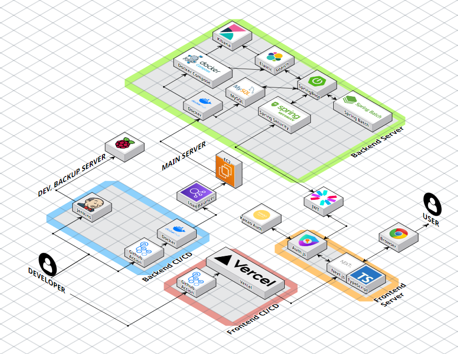

# 🌟 Starbucks E-Commerce Experience Revamp 🌟
**TEAM: Kim's Family**

> **신세계 I&C**와 **부산광역시**에서 주관하는 스파로스 아카데미 5기 소속 학생들이 진행한 **스타벅스 온라인 스토어 MSA 도입 프로젝트**

---

## 📚 프로젝트 소개

이 프로젝트는 **스타벅스 앱 아키텍처 재설계**를 목표로 진행된 이커머스 웹 애플리케이션 개발 프로젝트입니다. **MSA(Microservice Architecture)** 를 도입하기 위해 서비스스 및 DB Relation을 분할하고, 사용자 중심의 웹 서비스를 구현했습니다. 

단순한 기능 복제를 넘어서 실무에서 요구되는 기술 역량을 강화하고, 사용자에게 최적화된 서비스를 제공하는 것을 목적으로 기획되었습니다.

---

## 🚀 주요 기능

- **상품 리스트 조회**: 시즌 별 및 카테고리 별 상품을 쉽게 탐색 가능
- **상품 상세 페이지**: 선택된 상품의 상세 정보와 옵션 제공
- **장바구니 기능**: 상품을 장바구니에 추가하고 관리하는 기능
- **주문 및 결제 처리**: 장바구니 상품에 대한 주문 및 결제 기능 제공
- **회원 관리**: 회원 가입, 로그인, 회원 정보 수정 가능
- **쿠폰 시스템**: 다양한 할인 쿠폰 제공 및 적용 기능

---

## ⚙️ 기술 스택

- BE: Spring boot(3.2.8), JDK(17), Gradle(8.8), IntelliJ(2024.1.4)

 

- FE: Next.js(14.2.5), Node.js(20.5.1), TypeScript(5.1.3)

- INFRA: Ubuntu(Ubuntu 20.04 LTS), Docker(27.0.3), Docker-compose(2.28.1)

- DATABASE: MySQL(8.0.39), ElasticSearch(8.6.0)

- COMMON: Swagger(2.0.2), Kibana(8.6.0)

---

## 🗓️ 프로젝트 기간
**2024년 8월 6일** ~ **2024년 10월 1일**

---

## 👥 팀 구성

| 이름       | 역할                   |
| ---------- | ---------------------- |
| **김예진** | Team Leader, Front-End  |
| **김남우** | Back-End, Infra         |
| **김범규** | Front-End               |
| **김성태** | Back-End                |
| **박상언** | Back-End                |

---

## 🎯 프로젝트 목표

1. **스타벅스 온라인 스토어의 주요 기능 복제**  
   실제 서비스와 유사한 사용자 경험을 제공하는 웹 애플리케이션 개발
2. **프론트엔드와 백엔드 협업**  
   효율적인 협업을 통해 통합된 웹 서비스 구축
3. **최신 웹 기술 적용**  
   최신 기술 트렌드를 반영하여 실무에서의 문제 해결 능력 향상

---

## 🌐 사용해보기
> [프로젝트 사이트](https://starbuckskorea.kr) 에서 확인 가능

---

## 🏆 주요 성과

- **MSA 도입**을 통한 서비스 구조 개선
- **ElasticSearch**를 활용한 고속 검색 기능 구현
- **Kibana**와 **Spring Batch**를 활용한 추천 로직 구현
- **실제 서비스와 유사한 사용자 경험 제공**을 위한 UI/UX 최적화

---

## 🌐 아키텍처

---

## 📄 라이센스

해당 프로젝트는 오픈소스 라이센스 하에 배포되지 않습니다. 모든 권리는 Team Kim’s Family에게 있습니다.
